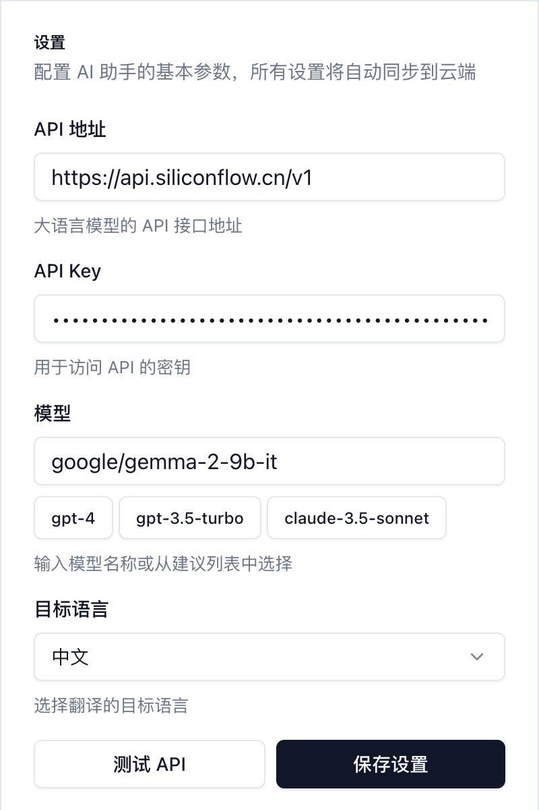
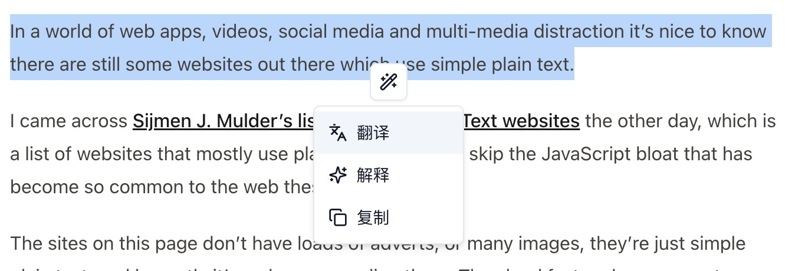
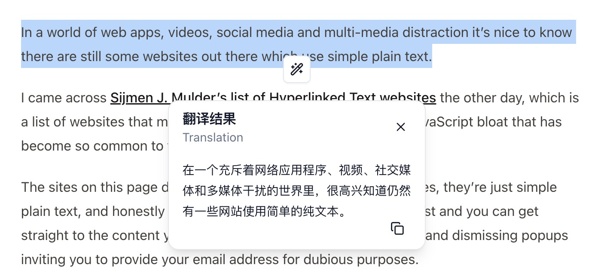

# Text Polish - 浏览器文本润色扩展 🤖

[English](./README.md) | [简体中文](./README.zh-CN.md)

基于 WXT 和 shadcn/ui 构建的 Chrome 扩展，提供 AI 文本处理能力。选中网页文本即可通过浮动菜单进行翻译、解释或快速复制。

## ✨ 功能特点

- 🔍 智能文本选中检测
- 🌐 一键多语言翻译
- 📚 AI 智能文本解析
- 📋 快速复制功能
- 🎯 跟随选择的浮动界面
- ⚡ 快速响应交互
- 🔒 安全的 API 密钥管理

## 🛠️ 技术栈

- **框架**: React + TypeScript
- **扩展框架**: WXT (WebExtension Tools)
- **UI 组件**: shadcn/ui
- **样式**: Tailwind CSS
- **图标**: Lucide React
- **状态管理**: React Hooks
- **API 集成**: OpenAI/Claude API

## 🚀 快速开始

1. 克隆仓库：`git clone https://github.com/hellokaton/text-polish-chrome-extension.git`
2. 安装依赖：

```bash
pnpm install
```

3. 启动开发服务器：

```bash
pnpm dev
```

这将自动完成：

- 启动开发服务器
- 在 Chrome 中加载扩展
- 启用开发热重载

代码修改后扩展会自动重新加载。

## 📸 截图示例





## 🔧 配置选项

通过弹出式设置面板可配置：

- API 端点配置
- API 密钥管理
- 模型选择
- 目标语言偏好

## 🤝 参与贡献

欢迎提交 Pull Request 参与贡献！

## 📝 开源协议

[MIT](LICENSE)

## 🙏 致谢

- 基于 [WXT](https://wxt.dev) 构建
- UI 组件来自 [shadcn/ui](https://ui.shadcn.com)
- 图标来自 [Lucide](https://lucide.dev)
